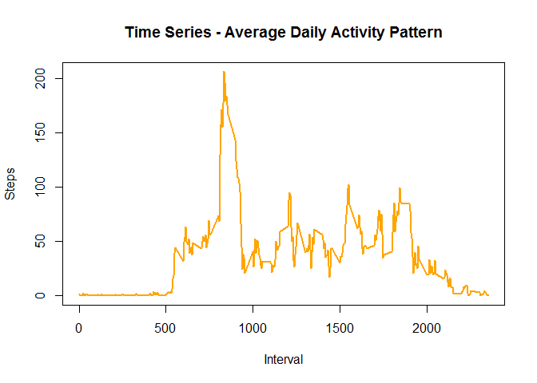
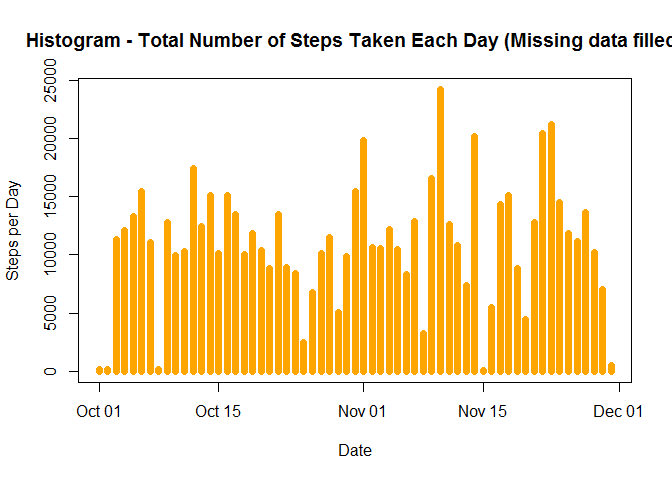

## Loading and preprocessing the data

```r
library(ggplot2)
library(reshape2)
library(gridExtra)

# data is downloaded and stored in a folder named data
MyData <- read.csv(file="./data/activity.csv", header = TRUE, sep = ",")
MyData$date <- as.Date(MyData$date)
```

## What is mean total number of steps taken per day?

```r
##aggregate total steps as per each date
actMeltDate <- melt(MyData, id.vars="date", measure.vars="steps", na.rm=FALSE)
actCastDate <- dcast(actMeltDate, date ~ variable, sum)
plot(actCastDate$date, actCastDate$steps, type="h", main="Histogram - Total Number of Steps Taken Each Day", xlab="Date", ylab="Steps per Day", col="blue", lwd=8)
```

 

##### a. Calculate the mean of the total number of steps taken per day

```r
cat("Mean of the total number of steps taken per day =", + mean(actCastDate$steps, na.rm=TRUE))
```

```
## Mean of the total number of steps taken per day = 10766.19
```

##### b. Calculate the median of the total number of steps taken per day

```r
cat("Median of the total number of steps taken per day =", median(actCastDate$steps, na.rm=TRUE))
```

```
## Median of the total number of steps taken per day = 10765
```

## What is the average daily activity pattern?

```r
##aggregate total steps as per each interval
actMeltInt <- melt(MyData, id.vars="interval", measure.vars="steps", na.rm=TRUE)
actCastInt <- dcast(actMeltInt, interval ~ variable, mean)
plot(actCastInt$interval, actCastInt$steps, type="l", main="Time Series - Average Daily Activity Pattern", xlab="Interval", ylab="Steps", col="orange", lwd=2)
```

 

###### a. Which 5-minute interval, on average across all the days in the dataset, contains the maximum number of steps?

```r
cat("Which 5-minute interval has Max number of steps? At", actCastInt$interval[which(actCastInt$steps == max(actCastInt$steps))], "with steps", max(actCastInt$steps))
```

```
## Which 5-minute interval has Max number of steps? At 835 with steps 206.1698
```

## Imputing missing values

##### a. Total number of missing values in the dataset

```r
cat("Total number of missing values in the dataset", sum(is.na(MyData$steps)))
```

```
## Total number of missing values in the dataset 2304
```


### Strategy for imputing missing data
###### Replace missing values with the mean taken during that 5-minute interval

##### b. Fill in Missing Data

```r
# create another data frame to store processed data frame
StepsByInt <- actCastInt

# Create new data frame to have NA replaced
MyDataNoNA <- MyData

# Merge both data set
MyDataMerge = merge(MyDataNoNA, StepsByInt, by="interval", suffixes=c(".mydat", ".sbi"))

# Get list of indexes where steps = NA
NaIndex = which(is.na(MyDataNoNA$steps))

# Replace NA values
MyDataNoNA[NaIndex,"steps"] = MyDataMerge[NaIndex,"steps.sbi"]
```

##### c. Create new data set with missing data filled in

```r
actMeltNoNaDate <- melt(MyDataNoNA, id.vars="date", measure.vars="steps", na.rm=FALSE)
actCastNoNaDate <- dcast(actMeltNoNaDate, date ~ variable, sum)
plot(actCastNoNaDate$date, actCastNoNaDate$steps, type="h", main="Histogram - Total Number of Steps Taken Each Day (Missing data filled)", xlab="Date", ylab="Steps per Day", col="orange", lwd=8)
```

 

##### d. Calculate the mean of the total number of steps taken per day

```r
cat("Mean of the total number of steps taken per day =", + mean(actCastNoNaDate$steps, na.rm=TRUE))
```

```
## Mean of the total number of steps taken per day = 10889.8
```

##### e. Calculate the median of the total number of steps taken per day

```r
cat("Median of the total number of steps taken per day =", median(actCastNoNaDate$steps, na.rm=TRUE))
```

```
## Median of the total number of steps taken per day = 11015
```

##### not much difference on mean and median when comparing with its first part of assignment

## Are there differences in activity patterns between weekdays and weekends?

```r
for (i in 1:nrow(MyDataNoNA)) {
  if (weekdays(MyDataNoNA$date[i]) == "Saturday" | weekdays(MyDataNoNA$date[i]) == "Sunday") {
    MyDataNoNA$NamesOfWeek[i] = "weekend"
  } else {
    MyDataNoNA$NamesOfWeek[i] = "weekday"
  }
}
```

##### Create two sets of data

```r
WeekdayAct <- subset(MyDataNoNA, NamesOfWeek=="weekday")
WeekendAct <- subset(MyDataNoNA, NamesOfWeek=="weekend")

actAggWeekday <- melt(WeekdayAct, id.vars="interval", measure.vars="steps")
actAggWeekend <- melt(WeekendAct, id.vars="interval", measure.vars="steps")
actCastWeekday <- dcast(actAggWeekday, interval ~ variable, mean)
actCastWeekend <- dcast(actAggWeekend, interval ~ variable, mean)
plot1 <- qplot(actCastWeekday$interval, actCastWeekday$steps, geom="line", data=actCastWeekday, type="bar", main="Steps by Interval - Weekday", xlab="Interval ID", ylab="Number of Steps")
plot2 <- qplot(actCastWeekend$interval, actCastWeekend$steps, geom="line", data=actCastWeekend, type="bar", main="Steps by Interval - Weekend", xlab="Interval ID", ylab="Number of Steps")
grid.arrange(plot1, plot2, nrow=2)
```

 


